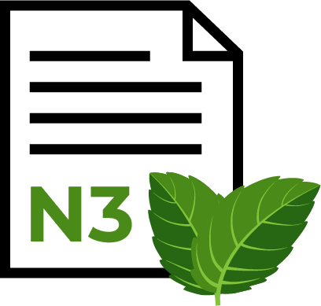

# N3NA3 Lang (CPP Compiler)

N3NA3 is a Hobby programming language. It is called N3NA3 because I had the idea of creating it while driking Morrocan tea with mint, and btw N3NA3 is an arabic word means mint

I even create a logo and a file icon for it :




I created this as an open project, to be an an entry for the open source bigineers.

For now the langague is designed for the x86 64 architecture, hopefully we will cover more architectures (ARM next i guess)

## Building
Requires `nasm` and `gcc` on a Windows operating system.

```bash
git clone https://github.com/scopenhasse/n3na3_programming_language
cd n3na3
mkdir build
cmake -S . -B build
cmake --build build
```

